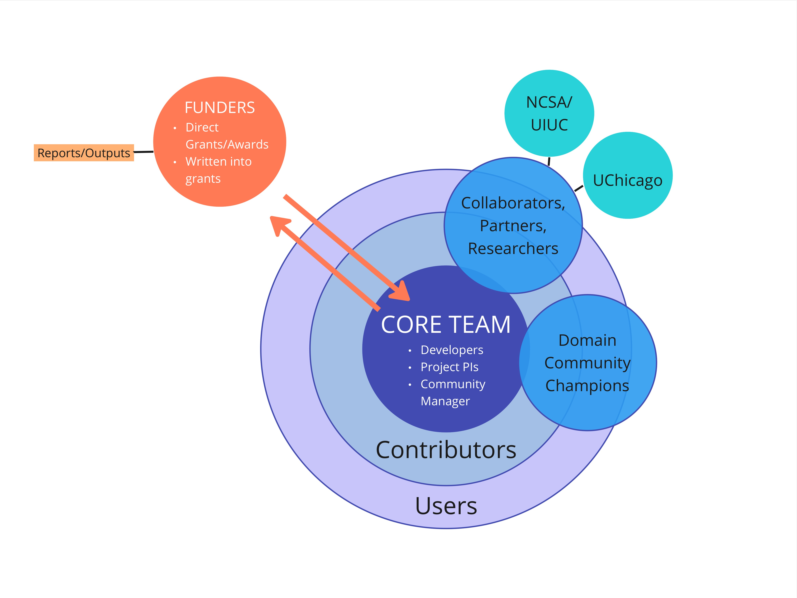

# 🌐 About Our Community

Parsl is an open source software package that parallelizes Python programs, constructs workflows and runs them scalably and efficiently on small to vast local and remote resources. The project’s first four years involved a small group of funded developers building out the tool and a community of 35 global contributors using Parsl for their work. Since the 1.0 production version release in 2020, the community has grown to over 75 global contributors and 280 members on Slack.

The goal of the community is to accelerate interdisciplinary research across academia and industry and foster a supportive space to contribute and make improvements to Parsl. Members include research software engineers, researchers, scientists, compute resource admins, and developers with varying levels of expertise, domains and disciplines, career levels, and geographic regions. Parsl serves as a basis for novel computer science research related to parallel and distributed computing, as well as enabling system administrators to support their users via a Python library that integrates with their research environment.

Community members discuss their experiences and share their work in several channels. Programming includes providing general support, sharing updates and stories in Slack, tracking and discussing technical issues in GitHub, a bi-weekly open Zoom call, and ParslFest, an annual event for knowledge sharing and networking.

## Community Sketch
This sketch provides a high-level view of how our community members, collaborators, and partners interact with each other.

