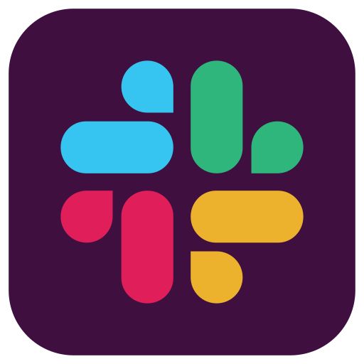
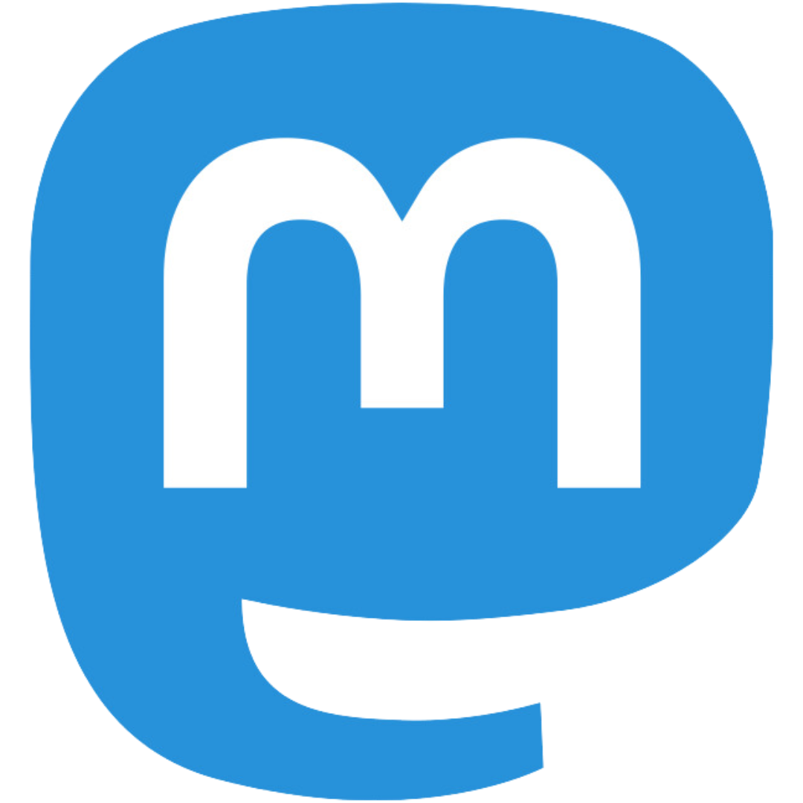

# 💡 How to Connect with the Community
Staying connected to each other is an integral part of the Parsl Community and our project sustainability. In this section, we go over the channels we use to communicate, connect, collaborate, get help, and get to know each other.

| Platform             | How We Use It                                                                          |
|------------------------------------|----------------------------------------------------------------------------------------|
|**GitHub**   |GitHub is where our project code lives. Users can access our source code, make contributions, report issues, learn how to use Parsl, and more. If you would like to suggest new features or participate in the discussion of implementation issues, please [follow us on GitHub](https://github.com/parsl). To contribute to our code, please read the [contributing guide](https://github.com/Parsl/parsl/blob/master/CONTRIBUTING.rst).|
|**Slack**    |Our primary daily communication platform is Slack. If you are using Parsl or planning to try it, [join the parsl-project Slack workspace](https://bit.ly/join-parsl-slack) to hear what other users are doing, ask questions, and listen in on and join the community discussion.|
|**Zoom**   | We use Zoom to connect with each other face-to-face for events such as our fortnightly Open Community Calls, annual hybrid gathering ParslFest, etc. [Join our Slack workspace](https://bit.ly/join-parsl-slack) to gain access to our Zoom links.|
|**Mastodon**   |We use Mastodon to connect our community on the social platform by sharing announcements, opportunities, upcoming events, etc. [Follow us on Mastodon](https://mast.hpc.social/@ParslProject).|
|**LinkedIn**   |We use LinkedIn to connect our community on the social platform by sharing announcements, opportunities, upcoming events, etc. [Follow us on LinkedIn](https://www.linkedin.com/company/parsl-project/).|

# 🗺️ Where to Connect
| Event Name | Description | When We Meet | Platform(s) |
|------------|-------------|--------------|----------|
|Open Community Calls|A fortnightly open call on Zoom where we get together to share project progress, discuss challenges, troubleshoot technical issues, and provide community updates. This call is mostly unstructured to allow space and time for people to drop by, ask questions, and provide input.|On a fortnightly basis (every two weeks) on Tuesdays @ 11 a.m. CST|Zoom|
|ParslFest|An annual hybrid community gathering that brings together researchers, developers, and cyberinfrastructure experts from around the world to discuss experiences using and developing Parsl and Globus Compute (formerly funcX). [Check out more details](https://parsl-project.org/parslfest.html).|Once a year for 2 days|In-Person & Zoom|
|Request a Consultation|If you're unsure of how Parsl can help accelerate your research and work or are stuck on an issue, please reach out to the respective technical sponsor on [Slack](https://bit.ly/join-parsl-slack) to request a 1:1 meeting.|Upon request and sponsor availability|Slack, Zoom, & Email

---
### 🤔 Questions or Inquiries?
If you have any additional questions or inquiries, please email us at [parsl@googlegroups.com](mailto:parsl@googlegroups.com).
